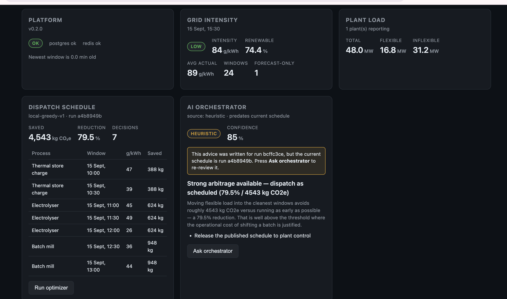

# EcoGrid OS

Autonomous industrial energy arbitrage & decarbonization platform.

**Current milestone: all layers delivered** — ingestion, platform core, plant
operations, AI orchestration, and an operator dashboard behind an edge gateway.

- **Phase 1 — Real-Time Grid Ingestion & The Event Backbone** (this repository):
  the local Dockerized infrastructure stack and the async Python ingestion
  worker that streams UK National Grid telemetry into Kafka.
- **Phase 2 — Platform Core** (also in this repository): a Kafka consumer that
  persists telemetry into PostgreSQL with idempotent upserts + an audit ledger, a
  Redis hot-read cache, a dead-letter path, and a FastAPI read API with API-key
  auth, ranked RBAC, rate limiting, and an append-only audit log.
- **Phase 3 — Plant Operations & Optimization** (also in this repository):
  an AS400 / legacy plant bridge that streams industrial load onto the event
  spine, plus a carbon-arbitrage optimization loop that schedules flexible load
  into the cleanest windows and publishes the dispatch schedule.
- **AI Orchestrator** (`ecogrid/orchestrator/`) — Claude reviews the optimizer's
  output and returns a structured recommendation. A deterministic heuristic
  advisor is the fallback whenever the model is unconfigured, unreachable, or
  unparseable, so advice never goes silent. Runs are tracked in MLflow (or a
  local JSONL sink when MLflow is absent).
- **Dashboard** (`dashboard/`) — React + TypeScript arbitrage dashboard.
- **Edge gateway** (`docker/nginx/`) — nginx terminating TLS, serving the
  dashboard, applying coarse per-IP rate limiting, and proxying to the API.



*The operator dashboard on a 24-window horizon: **4,543 kg CO₂e (79.5%)** saved by
shifting flexible load into the 04:30–07:30Z clean window. Live data, not a mockup.*

> **Verification status.** All layers are implemented and pass **118 automated
> tests** offline (no network, broker, or database required).
>
> **Verified live on a Docker host (2026-09-15):**
> * **All ten services reach `healthy`** across every profile — `postgres`,
>   `redis`, `kafka`, `api`, `consumer`, `plant-bridge`, `plant-consumer`,
>   `optimizer`, `orchestrator`, `gateway`. `migrate` and `certs-init` are
>   one-shots that exit `0`. ✅ UC-0
> * **Ingestion → ledger → API** (UC-1/2, UC-7/8): grid and plant telemetry
>   published, deduped and served; a duplicate delivery was suppressed rather
>   than double-counted.
> * **Auth, RBAC, rate limiting, audit** (UC-3–UC-6): 401 with no key, viewer 403
>   on admin routes, 120×200 then 10×429 with `Retry-After`, denials recorded.
> * **Gateway TLS and edge limiting** (UC-16): `:8443` terminates TLS, and nginx
>   throttles independently of the application's own limiter.
> * **The arbitrage** (UC-9/UC-10): a 24-window horizon moves the whole plant
>   into the clean window for **4,543 kg CO₂e (79.5%)**, nothing unscheduled.
> * **Migrations** (UC-17): `alembic upgrade head` reproduces the models exactly;
>   `--autogenerate` reports no drift.
>
> **Still unexecuted:** UC-11 (the bridge's Kafka-outage spool/replay), the
> `sasl` and `ha` topology overrides (configuration-verified only), and a
> multi-hour soak. Per-use-case criteria live in
> **[`docs/VERIFICATION.md`](docs/VERIFICATION.md)**.

---

## 1. Architecture

```text
                  React / TypeScript (Arbitrage Dashboard)
                                 │
                            API Gateway (Rate Limiting, TLS)
                                 │
                   ┌─────────────┴─────────────┐
                   │                           │
             Platform Core               AI Orchestrator
           (Auth, RBAC, Audit)          (Claude + MLflow)
                   │                           │
                   └─────────────┬─────────────┘
                                 │
                          Python / FastAPI
                                 │
            ┌────────────────────┼────────────────────┐
            │                    │                    │
       PostgreSQL              Redis                Kafka
     (State & Audit)       (Session Cache)      (Event Stream)
                                                      │
                                  ┌───────────────────┼───────────────────┐
                                  │                   │                   │
                            AS400 / Legacy      Databricks        Ext. Modules
                         (Plant Operations)   (Optimization)   (UK Carbon Intensity API)
```

### Phase 1 scope — Real-Time Grid Ingestion & Event Backbone

```text
   ┌──────────────────────────────────────────────────────────────────┐
   │  api.carbonintensity.org.uk                                      │
   │    GET /intensity      → forecast, actual, index                 │
   │    GET /generation     → generationmix[] per fuel                │
   └───────────────────────────────┬──────────────────────────────────┘
                                   │  poll every 300s
                                   ▼
   ┌──────────────────────────────────────────────────────────────────┐
   │  ingest_grid.py  (async worker)                                  │
   │    1. fetch both endpoints concurrently (httpx, HTTP/2)          │
   │    2. validate → Pydantic envelopes                              │
   │    3. merge on (from, to) window → GridTelemetry                 │
   │    4. publish → Kafka, keyed by window start                     │
   │    ↳ on failure: retry w/ backoff → JSONL spool → replay         │
   └───────────────────────────────┬──────────────────────────────────┘
                                   │
                    topic: ecogrid.telemetry.carbon
                                   │
        ┌──────────────────────────┼──────────────────────────┐
        ▼                          ▼                          ▼
   PostgreSQL 15              Redis 7                 Apache Kafka (KRaft)
   state & audit              session cache            event spine :9092
```

### Phase 2 scope — Platform Core (also built here)

```text
              topic: ecogrid.telemetry.carbon
                          │
                          ▼  consume (manual offset commit after DB write)
   ┌──────────────────────────────────────────────────────────────────┐
   │  ecogrid.consumer (idempotent upsert on window_from)             │
   │    • dedupe via INSERT … ON CONFLICT (window_from) DO UPDATE      │
   │      WHERE payload_hash IS DISTINCT FROM EXCLUDED.payload_hash     │
   │    • per-partition audit ledger (last_offset + counters)          │
   │    • bad records → ecogrid.telemetry.carbon.dlq                   │
   │    • Redis hot-read cache (newer-window-wins)                     │
   └───────────┬───────────────────────────────┬─────────────────────┘
               ▼                               ▼
        PostgreSQL 15                     Redis 7
        telemetry + audit ledger          hot-read cache

   ┌──────────────────────────────────────────────────────────────────┐
   │  FastAPI  /api/v1   (API-key auth · RBAC · rate limit · audit)    │
   │    /healthz  /whoami  /telemetry/latest  /telemetry (keyset)     │
   │    /telemetry/stats  /telemetry/{window_from}                    │
   │    /audit (admin)   /ingest-status                                │
   └──────────────────────────────────────────────────────────────────┘
```

### Phase 3 scope — Plant Operations & Optimization

```text
   ┌──────────────────────────────────────────────────────────────────┐
   │  AS400 / IBM i  (legacy plant operations)                        │
   │    sources: simulated · file (batch drop) · odbc (live DSN)      │
   └───────────────────────────┬──────────────────────────────────────┘
                               ▼  ecogrid.plant.bridge (poll 300s)
                    topic: ecogrid.telemetry.plant
                               │
                               ▼  ecogrid.plant.consumer (idempotent upsert)
                        PostgreSQL · plant_telemetry
                               │
   ┌───────────────────────────┴──────────────────────────────────────┐
   │  Optimization loop                                               │
   │    carbon forecast  ×  flexible capacity  →  dispatch schedule   │
   │    Databricks job if configured, else local greedy solver        │
   └───────────┬───────────────────────────────────┬──────────────────┘
               ▼                                   ▼
   PostgreSQL · optimization_runs          topic: ecogrid.decisions.schedule
                schedule_decisions                 (plant control systems)
               │
               ▼
   FastAPI  /api/v1/plant/latest · /plant · /schedule/latest · POST /optimize/run
```

---

## 2. Quickstart

```bash
# 1. Configure
cp .env.example .env

# 2. Bring up the event backbone (PostgreSQL + Redis + Kafka + topic bootstrap)
docker compose up -d
docker compose logs -f kafka-init        # wait for "provisioning topics... done."

# 3a. Run the worker on the host
python -m venv .venv && source .venv/bin/activate
pip install -r requirements.txt
python ingest_grid.py

# 3b. …or run it as a container alongside the stack
docker compose --profile worker up -d --build
docker compose logs -f ingestor

# 3c. Bring up Platform Core (migrate → consumer → API) as containers
docker compose --profile platform build
docker compose --profile platform up -d
docker compose logs -f migrate      # prints the bootstrap admin API key once
docker compose logs -f consumer     # consumes ecogrid.telemetry.carbon
docker compose logs -f api          # FastAPI on http://localhost:8000 (override via API_HOST_PORT)

# Or run the Platform Core pieces on the host (needs a live PG/Redis/Kafka):
python -m ecogrid.migrate          # applies schema, prints bootstrap admin key
python -m ecogrid.consumer         # starts the idempotent consumer
uvicorn ecogrid.api:app --port 8000

# 3d. Bring up Phase 3 (plant bridge → plant consumer → optimizer)
docker compose --profile phase3 up -d --build
docker compose logs -f plant-bridge     # publishes ecogrid.telemetry.plant
docker compose logs -f plant-consumer   # persists into plant_telemetry
docker compose logs -f optimizer        # emits schedules to ecogrid.decisions.schedule

# Or run the Phase 3 pieces on the host (needs a live PG/Redis/Kafka):
python -m ecogrid.plant.bridge          # AS400 plant-operations bridge
python -m ecogrid.plant.consumer        # plant telemetry consumer
python -m ecogrid.optimizer.loop        # carbon-arbitrage optimization loop
```

To **prove** each capability rather than just start it, follow the numbered use
cases in [`docs/VERIFICATION.md`](docs/VERIFICATION.md) — each gives exact commands
and explicit pass/fail criteria.

### Managing API keys (RBAC)

The bootstrap admin key printed by `migrate` is the only credential at first.
Create scoped keys to exercise the viewer / operator roles:

```bash
# Inside the running stack (reuses the migrate service env + Postgres dependency)
docker compose --profile platform run --rm --entrypoint python migrate \
  -m ecogrid.keys create --name "dashboard-viewer" --role viewer

# Or on the host with the same ECOGRID_* env the API uses:
python -m ecogrid.keys create --name "dashboard-viewer" --role viewer
python -m ecogrid.keys list
python -m ecogrid.keys revoke --name "dashboard-viewer" --reason "offboarded"
```

Keys are stored as SHA-256 digests only; the raw value is shown once at creation
and is never recoverable. Send it as the `X-API-Key` header. Role precedence:
`viewer < operator < admin`.

---

Verify events are landing:

```bash
docker compose exec kafka kafka-console-consumer \
  --bootstrap-server kafka:29092 \
  --topic ecogrid.telemetry.carbon \
  --from-beginning --max-messages 3 --property print.key=true
```

Smoke-test without Kafka:

```bash
python ingest_grid.py --once --dry-run
```

Run the offline contract tests (no network, no broker):

```bash
pytest -q                       # 118 tests across all phases; integration tests
                                # requiring a live PostgreSQL auto-skip if unreachable
```

---

## 3. Services

| Service | Image | Host port | Purpose | Volume |
|---|---|---|---|---|
| `postgres` | `postgres:15-alpine` | `127.0.0.1:${POSTGRES_HOST_PORT:-5432}` | System state, RBAC, audit ledger | `ecogrid-postgres-data` |
| `redis` | `redis:7-alpine` | `127.0.0.1:${REDIS_HOST_PORT:-6379}` | Session cache, rate-limit counters | `ecogrid-redis-data` |
| `kafka` | `confluentinc/cp-kafka:7.6.1` | `127.0.0.1:${KAFKA_HOST_PORT:-9092}` | Event stream spine (KRaft, no ZooKeeper) | `ecogrid-kafka-data` |
| `kafka-init` | same as `kafka` | — | One-shot idempotent topic provisioner | — |
| `ingestor` | local build | — | Grid telemetry worker (`--profile worker`) | `./data` |
| `migrate` | `ecogrid/platform-core:phase3` | — | One-shot schema bootstrap + admin key (`--profile platform`) | — |
| `consumer` | `ecogrid/platform-core:phase3` | — | Kafka → PostgreSQL idempotent upsert + Redis cache (`--profile platform`) | — |
| `api` | `ecogrid/platform-core:phase3` | `127.0.0.1:${API_HOST_PORT:-8000}` | FastAPI read API: auth / RBAC / rate limit / audit (`--profile platform`) | — |
| `plant-bridge` | `ecogrid/platform-core:phase3` | — | AS400 plant-operations bridge → `ecogrid.telemetry.plant` (`--profile phase3`) | `./data` |
| `plant-consumer` | `ecogrid/platform-core:phase3` | — | Plant telemetry → PostgreSQL, idempotent on `(plant_id, window_from)` (`--profile phase3`) | — |
| `optimizer` | `ecogrid/platform-core:phase3` | — | Carbon-arbitrage loop → `ecogrid.decisions.schedule` (`--profile phase3`) | — |
| `orchestrator` | `ecogrid/platform-core:phase3` | — | AI Orchestrator: Claude + heuristic fallback → `ecogrid.decisions.advice` (`--profile ai`) | `./data` |
| `certs-init` | `alpine:3.19` | — | One-shot self-signed TLS material for the gateway (`--profile gateway`) | `./certs` |
| `gateway` | `nginx:1.27-alpine` | `127.0.0.1:${GATEWAY_HTTP_PORT:-8080}` · `${GATEWAY_HTTPS_PORT:-8443}` | TLS termination, static dashboard, per-IP rate limit, reverse proxy (`--profile gateway`) | — |

**Host port collisions.** Dev machines frequently already run native
PostgreSQL on 5432 and Redis on 6379, which makes `docker compose up` fail with
`address already in use`. Override the host binding in `.env` without touching
the in-container port:

```bash
POSTGRES_HOST_PORT=15432
REDIS_HOST_PORT=16379
KAFKA_HOST_PORT=9092     # must match ECOGRID_KAFKA_BOOTSTRAP_SERVERS
```

`KAFKA_HOST_PORT` must stay in step with `KAFKA_ADVERTISED_LISTENERS` — if the
published port and the advertised port disagree, clients connect and then
receive unreachable broker metadata on the first metadata fetch.

**Kafka listeners.** KRaft mode runs a single combined broker+controller node
(`KAFKA_PROCESS_ROLES=broker,controller`). Two listeners are advertised:

| Client location | Bootstrap server |
|---|---|
| Another container on `ecogrid-net` | `kafka:29092` |
| Host machine (worker running via venv) | `localhost:9092` |

`KAFKA_AUTO_CREATE_TOPICS_ENABLE=false` — topics are provisioned explicitly by
`kafka-init`, so a typo'd topic name fails loudly instead of silently creating
an unconfigured one.

**Healthcheck target.** The Kafka healthcheck probes `kafka:29092`, *not*
`localhost:29092`. The `PLAINTEXT` listener is bound to the `kafka` hostname, so
inside the container `localhost:29092` refuses connections while `kafka:29092`
answers. Probing the wrong one leaves the broker permanently `unhealthy` even
though it is running fine, which blocks `kafka-init` and the worker from
starting.

---

## 4. Event contract

**Topic:** `ecogrid.telemetry.carbon`
**Key:** window start, ISO-8601 UTC (`2026-09-14T17:00:00Z`)
**Value:** UTF-8 JSON, one record per half-hourly settlement window

```json
{
  "schema_version": "1.0.0",
  "source": "api.carbonintensity.org.uk",
  "window_from": "2026-09-14T17:00:00Z",
  "window_to": "2026-09-14T17:30:00Z",
  "forecast_intensity": 266,
  "actual_intensity": 263,
  "carbon_index": "moderate",
  "generation_mix": { "biomass": 6.1, "gas": 42.1, "nuclear": 14.4, "solar": 8.0, "wind": 35.5 },
  "renewable_percentage": 43.5,
  "low_carbon_percentage": 57.9,
  "fossil_percentage": 42.1,
  "is_forecast_only": false,
  "generation_mix_missing": false,
  "ingested_at": "2026-09-14T17:05:12.884Z"
}
```

### Design notes

- **Delivery is at-least-once, not exactly-once.** This was established
  empirically against a live broker, not assumed. A record whose send the worker
  gave up on (and spooled for replay) was still delivered ~9 seconds later by the
  producer's own internal retry during `flush()` at shutdown — and then delivered
  *again* when the spool was replayed. The same window can therefore arrive twice.
  **Consumers must dedupe on the message key** (or `INSERT ... ON CONFLICT
  (window_from) DO UPDATE`). The producer is idempotent (`enable_idempotence`,
  `acks=all`), which eliminates broker-side duplicates within a session, but it
  cannot make the spool-and-replay path exactly-once.
- **Keyed by window start.** Consumers can dedupe or log-compact on the key.
  The topic is `cleanup.policy=compact,delete` with a 7-day retention. Because
  the key is stable, every revision of a window lands on the same partition and
  therefore stays ordered.
- **`actual_intensity` may be `null`.** The grid operator publishes intensity
  forecasts before settlement. `is_forecast_only` flags those windows and
  `effective_intensity` (Python property) resolves to the forecast.
- **Merge is keyed on `(from, to)`, never array position.** `/intensity` and
  `/generation` are separate HTTP calls and may return different-length arrays
  or arrive out of order. Intensity windows with no matching generation window
  are still emitted with `generation_mix_missing=true` — the carbon signal
  alone is actionable.
- **Unchanged windows are suppressed in-process.** The API returns the forward
  24h of half-hourly data, so a naive worker republishes ~48 identical records
  every cycle. The worker hashes each payload and skips no-op republishes;
  a revised forecast or a settled `actual` produces a new hash and is published.
  Set `ECOGRID_PUBLISH_UNCHANGED_WINDOWS=true` to disable suppression. Note this
  cache is per-process: a restart republishes the current window (harmless, and
  deduped by the key).
- **Reject, never forward.** Any payload failing Pydantic validation is logged
  and dropped. Nothing unvalidated reaches Kafka.

---

## 5. Resilience model

| Failure | Handling |
|---|---|
| DNS/connection reset, timeout | Exponential backoff with jitter, `ECOGRID_HTTP_MAX_ATTEMPTS` (default 5), base 1s → cap 60s |
| HTTP 429 / 5xx | Retried; `Retry-After` honoured and clamped to 300s |
| HTTP 4xx (non-retryable) | Fail fast for that cycle — retrying a malformed request is noise |
| Non-JSON / non-object body | Treated as transient, retried, then aborts the cycle |
| One endpoint down | Both are fetched with `return_exceptions=True`; the cycle fails cleanly and the loop survives |
| Kafka broker unavailable at boot | Admin API polled until `ECOGRID_KAFKA_BROKER_WAIT_SECONDS` (default 90s) elapses, then exit code 2 |
| Kafka send failure | Bounded retry per record; on exhaustion the record is appended to a JSONL spool. Delivery is at-least-once, so the same window may arrive twice — consumers dedupe on the key |
| Send that never resolves (unknown topic) | Bounded per attempt by `ECOGRID_KAFKA_SEND_TIMEOUT_SECONDS` (default 15s) via `asyncio.wait_for`. Without this, a typo'd topic name stalls ~30s per attempt — 150s across 5 attempts, inside a 300s cycle |
| Spool overflow | Oldest lines dropped past `ECOGRID_SPOOL_MAX_RECORDS` (default 10 000) — a dead broker cannot fill the disk |
| Corrupt spool line | Discarded with a warning; valid lines still replay |
| Spool drained | **Truncated to zero bytes, never unlinked.** Deleting needs a delete syscall, which some environments guard or forbid — in testing that terminated the worker mid-replay and left a stale spool behind |
| Unexpected error mid-cycle | Caught by an outer safety net, logged with a traceback, loop continues to the next cadence. A single bad cycle must never kill a 24/7 worker |
| SIGINT / SIGTERM | Loop stops after the in-flight cycle, producer flushed, exit 0 |

The spool is replayed at the start of every cycle and again before each
publish, so an outage is self-healing without operator intervention.

### Verified against a live broker

These behaviours were exercised end-to-end, not inferred from the code:

| Check | Result |
|---|---|
| Full stack boots, all healthchecks green | ✅ PostgreSQL / Redis / Kafka all `healthy` |
| `kafka-init` provisions the topic | ✅ 3 partitions, `cleanup.policy=compact,delete`, 7-day retention |
| Live API → Kafka publish | ✅ real window ingested and readable back off the topic |
| Partition keying | ✅ 9 messages, all on partition 0 (same window key) |
| In-process dedupe over 3 cycles at 30s cadence | ✅ cycle 1 `published=1`, cycles 2–3 `published=0`; broker offsets confirm zero duplicates |
| Send failure → spool → replay | ✅ record spooled on failure, drained on recovery, spool truncated to 0 bytes |
| **Kafka killed mid-run, then restored** | ✅ send timed out → retried → spooled → replayed on recovery; worker survived all 5 cycles; no data lost |
| Graceful SIGTERM mid-run | ✅ finished the in-flight cycle, flushed the producer, exit 0 |
| Send bound | ✅ unresolvable topic fails in 12s, not 150s |
| Broker unreachable at boot | ✅ retries with backoff, then exit code 2 |
| Worker runs as a container | ✅ image builds; connects via `kafka:29092`; publishes; container health reaches `healthy` |
| Container heartbeat healthcheck | ✅ heartbeat file written through the `./data` bind mount, probe exits 0 |

> Note on test design: the first mid-run outage test **passed vacuously**. With
> dedupe enabled the window was unchanged, so cycles 2–4 skipped the send
> entirely (`published=0 failed=0`) and the outage was never exercised. The test
> only became meaningful with `ECOGRID_PUBLISH_UNCHANGED_WINDOWS=true`, forcing
> a send every cycle.

### Known gaps

- **No long soak test at the 300s production cadence.** ✅ The Phase 2 stack is
  confirmed to *boot and run* as containers (postgres/redis/kafka `healthy`,
  consumer + api up), and a bounded live run behaved correctly (26 messages → 2
  ledger rows, 22 duplicates suppressed, 2 revisions; per-partition audit
  reconciles to 26; API passed auth / RBAC / rate-limit / 404 / 429 checks).
  Still untested is hours of continuous running, so slow leaks (dedupe-cache
  growth, connection-pool exhaustion, file-descriptor drift) remain unverified.
- **Phase 3 / AI / gateway services — ✅ brought up and healthy.** `plant-bridge`,
  `plant-consumer`, `optimizer`, `orchestrator` and `gateway` all reached
  `healthy` on a Docker host (2026-09-15). What is *not* yet exercised: the
  `sasl` and `ha` overrides, and the individual use-case assertions in
  `docs/VERIFICATION.md`.
- **Single broker, no cluster-level fault injection.** Broker *availability* was
  tested (stop/start mid-run). Broker *degradation* — leader elections, ISR
  shrinkage, disk-full — was not, and would need a multi-node cluster.

**Liveness.** The worker touches `ECOGRID_HEARTBEAT_PATH` after every
successful cycle. The container healthcheck marks it unhealthy after 3 missed
cycles (900s), which is the real signal that ingestion has stalled.

---

## 6. Configuration reference

All worker settings are read from `ECOGRID_*` environment variables (or a
`.env` file), validated by `pydantic-settings`.

| Variable | Default | Notes |
|---|---|---|
| `ECOGRID_KAFKA_BOOTSTRAP_SERVERS` | `localhost:9092` | `kafka:29092` inside Compose |
| `ECOGRID_KAFKA_TOPIC` | `ecogrid.telemetry.carbon` | |
| `ECOGRID_KAFKA_TOPIC_PARTITIONS` | `3` | Applied at topic creation only |
| `ECOGRID_KAFKA_MAX_ATTEMPTS` | `5` | Per-record send retries |
| `ECOGRID_KAFKA_BACKOFF_BASE_SECONDS` / `_MAX_SECONDS` | `1.0` / `30.0` | Kafka retry backoff |
| `ECOGRID_KAFKA_BROKER_WAIT_SECONDS` | `90.0` | Boot-time broker wait |
| `ECOGRID_KAFKA_SEND_TIMEOUT_SECONDS` | `15.0` | Hard ceiling per send attempt (enforced with `asyncio.wait_for`) |
| `ECOGRID_KAFKA_REQUEST_TIMEOUT_MS` | `15000` | Underlying produce request timeout |
| `ECOGRID_INTENSITY_URL` | `https://api.carbonintensity.org.uk/intensity` | |
| `ECOGRID_GENERATION_URL` | `https://api.carbonintensity.org.uk/generation` | |
| `ECOGRID_HTTP_TIMEOUT_SECONDS` | `15.0` | Connect timeout capped at 5s |
| `ECOGRID_HTTP_MAX_ATTEMPTS` | `5` | Per-request retries |
| `ECOGRID_HTTP_BACKOFF_BASE_SECONDS` / `_MAX_SECONDS` | `1.0` / `60.0` | HTTP retry backoff |
| `ECOGRID_POLL_INTERVAL_SECONDS` | `300` | Minimum 30; cadence is drift-corrected |
| `ECOGRID_SPOOL_PATH` | `./data/spool/telemetry-spool.jsonl` | Durability buffer |
| `ECOGRID_SPOOL_MAX_RECORDS` | `10000` | Bounded on-disk backlog |
| `ECOGRID_HEARTBEAT_PATH` | `./data/heartbeat` | Liveness marker |
| `ECOGRID_PUBLISH_UNCHANGED_WINDOWS` | `false` | Disable dedupe to republish everything |
| `ECOGRID_LOG_LEVEL` | `INFO` | |

### Platform Core settings

Read by `ecogrid.consumer`, `ecogrid.api`, and `ecogrid.migrate` under the same
`ECOGRID_*` prefix (validated by `PlatformSettings`). The Compose `platform`
profile already supplies the in-network infra hostnames — override these only to
point at external services.

| Variable | Default | Notes |
|---|---|---|
| `ECOGRID_POSTGRES_DSN` | _(required)_ | SQLAlchemy URL; `postgresql://` is rewritten to `postgresql+asyncpg://` |
| `ECOGRID_REDIS_URL` | `redis://localhost:6379/0` | Hot-read cache + rate-limit counters |
| `ECOGRID_KAFKA_BOOTSTRAP_SERVERS` | `localhost:9092` | `kafka:29092` inside Compose |
| `ECOGRID_KAFKA_TOPIC` | `ecogrid.telemetry.carbon` | |
| `ECOGRID_KAFKA_CONSUMER_GROUP` | `ecogrid-platform-core` | Group the consumer commits offsets under |
| `ECOGRID_API_KEY_HEADER` | `X-API-Key` | Header carrying the API key |
| `ECOGRID_BOOTSTRAP_ADMIN_KEY` | _(none)_ | Fixed admin key; if unset, `migrate` generates one and prints it once |
| `ECOGRID_RATE_LIMIT_ENABLED` | `true` | Fail-open: a Redis outage lets requests through |
| `ECOGRID_RATE_LIMIT_REQUESTS` | `120` | Max requests per `ECOGRID_RATE_LIMIT_WINDOW_SECONDS` (fixed window) |
| `ECOGRID_RATE_LIMIT_WINDOW_SECONDS` | `60` | |

### Phase 3 settings

Read by `ecogrid.plant.bridge`, `ecogrid.plant.consumer`, and
`ecogrid.optimizer.loop` (same `ECOGRID_*` prefix). The Compose `phase3` profile
supplies sane defaults; override to point at real plant systems.

| Variable | Default | Notes |
|---|---|---|
| `ECOGRID_KAFKA_PLANT_TOPIC` | `ecogrid.telemetry.plant` | Plant load events |
| `ECOGRID_KAFKA_DECISIONS_TOPIC` | `ecogrid.decisions.schedule` | Published dispatch schedules |
| `ECOGRID_PLANT_SOURCE` | `simulated` | `simulated` \| `file` \| `odbc` |
| `ECOGRID_PLANT_IDS` | `plant-01` | Comma-separated plant identifiers |
| `ECOGRID_PLANT_FILE_DIR` | `./data/as400` | Batch-drop directory for `source=file` |
| `ECOGRID_PLANT_BASE_LOAD_MW` | `40` | Simulated plant size |
| `ECOGRID_PLANT_FLEXIBLE_FRACTION` | `0.35` | Share of load the optimizer may move |
| `ECOGRID_PLANT_POLL_INTERVAL_SECONDS` | `300` | Bridge cadence |
| `ECOGRID_PLANT_SPOOL_PATH` | `./data/spool/plant-spool.jsonl` | Durability buffer |
| `ECOGRID_OPTIMIZER_HORIZON_WINDOWS` | `24` | Windows considered (24 = 12 h) |
| `ECOGRID_OPTIMIZER_INTERVAL_SECONDS` | `900` | Optimization cadence |
| `ECOGRID_OPTIMIZER_PROCESSES_JSON` | _(none)_ | JSON portfolio; falls back to the built-in 3 processes |
| `ECOGRID_DATABRICKS_HOST` / `_TOKEN` / `_JOB_ID` | _(none)_ | Set all three to run on Databricks; otherwise the local solver is used |

### AI Orchestrator settings

| Variable | Default | Notes |
|---|---|---|
| `ECOGRID_ORCHESTRATOR_ENABLED` | `true` | When false the loop idles instead of advising |
| `ECOGRID_ORCHESTRATOR_INTERVAL_SECONDS` | `1800` | How often it reviews the schedule |
| `ECOGRID_ANTHROPIC_API_KEY` | _(none)_ | **Unset ⇒ the heuristic advisor is used.** Advice never disappears |
| `ECOGRID_ANTHROPIC_MODEL` | `claude-sonnet-4-20250514` | Pin a specific revision for reproducibility |
| `ECOGRID_MLFLOW_TRACKING_URI` | _(none)_ | Unset (or mlflow absent) ⇒ local JSONL run log |
| `ECOGRID_MLFLOW_EXPERIMENT` | `ecogrid-optimization` | |
| `ECOGRID_ORCHESTRATOR_TRACKING_PATH` | `./data/orchestrator-runs.jsonl` | Fallback run log |

### Gateway settings

| Variable | Default | Notes |
|---|---|---|
| `GATEWAY_HTTP_PORT` | `8080` | Plain HTTP (dashboard + proxy) |
| `GATEWAY_HTTPS_PORT` | `8443` | TLS. Certs are read from `./certs` |

### Kafka security (platform → broker)

A **separate hop** from the gateway's TLS. The nginx gateway protects
client→platform; these settings authenticate the platform's own connections to
Kafka. Enabling one does not enable the other.

| Variable | Default | Notes |
|---|---|---|
| `ECOGRID_KAFKA_SECURITY_PROTOCOL` | `PLAINTEXT` | `PLAINTEXT` \| `SASL_PLAINTEXT` \| `SASL_SSL` |
| `ECOGRID_KAFKA_SASL_MECHANISM` | `PLAIN` | `PLAIN` \| `SCRAM-SHA-256` \| `SCRAM-SHA-512` |
| `ECOGRID_KAFKA_SASL_USERNAME` / `_PASSWORD` | _(none)_ | **Required** whenever the protocol is not `PLAINTEXT`; startup fails loudly if half-set |

### Production topologies

Two compose overrides ship with the repo. Neither is active by default, so local
behaviour is unchanged.

| Override | Purpose | Command |
|---|---|---|
| `docker-compose.sasl.yml` | SASL/PLAIN auth on the platform → broker hop | `docker compose -f docker-compose.yml -f docker-compose.sasl.yml --profile platform up -d` |
| `docker-compose.ha.yml` | 3-node KRaft cluster, RF=3, min-ISR=2 | `docker compose -f docker-compose.yml -f docker-compose.ha.yml up -d` |

They compose — pass both `-f` flags for an authenticated, replicated cluster.
Note: SASL/PLAIN sends credentials in cleartext across the cluster network, so
move to `SASL_SSL` with certificates on any shared network.

**Why 300 seconds?** The upstream API publishes at half-hourly granularity, so
a 5-minute cadence is ~6× oversampled — fast enough to catch revised forecasts
and settle windows promptly, while staying comfortably inside the public rate
limit.

---

## 7. Operations

```bash
# Tail worker logs (UTC timestamps, index + intensity per cycle)
docker compose logs -f ingestor

# Inspect consumer-group lag (Platform Core group: ${KAFKA_CONSUMER_GROUP:-ecogrid-platform-core})
docker compose exec kafka kafka-consumer-groups --bootstrap-server kafka:29092 --all-groups --describe

# Describe the telemetry topic
docker compose exec kafka kafka-topics --bootstrap-server kafka:29092 --describe --topic ecogrid.telemetry.carbon

# Tear down, keeping data volumes
docker compose down

# Tear down and destroy all state
docker compose down -v
```

---

## 8. Repository layout

```text
ecogrid-os/
├── docker-compose.yml        # PostgreSQL 15 · Redis 7 · Kafka (KRaft) · topic init
│                           #   · ingestor (profile: worker) · migrate / consumer /
│                           #     api (profile: platform)
├── Dockerfile               # Slim non-root image for the ingestion worker
├── Dockerfile.platform      # One image (ecogrid/platform-core:phase3); all services
├── ingest_grid.py           # Phase 1 async ingestion worker
├── ecogrid/                 # Platform Core package (Phases 2 + 3)
│   ├── config.py           #   PlatformSettings (ECOGRID_*) — DSN/URL normalisation
│   ├── models.py           #   SQLAlchemy 2.0 async models (grid, plant, runs, keys, audit)
│   ├── consumer.py         #   TelemetryConsumer (idempotent upsert + DLQ + audit)
│   ├── api.py              #   FastAPI read API (auth · RBAC · rate limit · audit)
│   ├── security.py         #   Role enum · SHA-256 key hashing · auth dependency
│   ├── db.py cache.py ratelimit.py audit.py schemas.py   # supporting modules
│   ├── migrate.py keys.py logging_setup.py
│   ├── plant/              #   Phase 3 — AS400 / legacy plant bridge
│   │   ├── models.py       #     PlantTelemetry contract (flexible vs inflexible load)
│   │   ├── sources.py      #     simulated · file (batch drop) · odbc (live seam)
│   │   ├── bridge.py       #     poll → validate → publish (retry + JSONL spool)
│   │   └── consumer.py     #     Kafka → PostgreSQL, idempotent on (plant_id, window)
│   └── optimizer/          #   Phase 3 — carbon-arbitrage optimization loop
│       ├── solver.py       #     greedy lowest-carbon block scheduler
│       ├── databricks.py   #     Databricks job submission + local fallback
│       └── loop.py         #     forecast + capacity → schedule → Kafka
│   └── orchestrator/       #   AI Orchestrator (Claude + MLflow)
│       ├── advice.py       #     ClaudeAdvisor + deterministic HeuristicAdvisor
│       ├── tracking.py     #     MLflow sink with local JSONL fallback
│       ├── context.py      #     assembles the state the advisor reasons over
│       └── loop.py         #     state → advice → persist → publish → track
├── dashboard/               # React + TypeScript arbitrage dashboard (Vite)
│   ├── src/api.ts          #   typed client for /api/v1
│   └── src/App.tsx         #   platform · grid · plant · schedule · orchestrator
├── alembic/                 # Schema migrations (baseline + future revisions)
├── docker/nginx/nginx.conf  # Edge gateway: TLS, static assets, rate limiting
├── docker-compose.sasl.yml  # Opt-in SASL auth for the platform → broker hop
├── docker-compose.ha.yml    # Opt-in 3-node KRaft cluster (RF=3, min-ISR=2)
├── ecogrid/kafka.py         # Shared Kafka auth for every client
├── scripts/seed_demo_data.py# Synthetic history through the real pipeline (demos)
├── test_ingest_grid.py      # Phase 1 offline contract + resilience tests
├── test_platform.py         # Phase 2 unit + integration tests (auto-skip if no PG)
├── test_phase3.py           # Phase 3 tests: plant contract, sources, solver maths
├── test_ai_orchestrator.py  # Orchestrator tests: advice, fallback, tracking
├── requirements.txt         # Phase 1 pinned deps (Python 3.11+)
├── requirements-platform.txt# Phase 2 deps (-r requirements.txt + FastAPI/SQLAlchemy/asyncpg)
├── .env.example             # Configuration template
├── data/
│   └── spool/               # Durability buffer (JSONL) + heartbeat marker
└── docs/
    ├── ARCHITECTURE.md      # Design contract, at-least-once rationale, deferred decisions
    └── VERIFICATION.md      # Use-case verification: step-by-step proof each feature works
```

---

## 9. Roadmap

- **Phase 1 (done)** — grid ingestion + event backbone: `docker compose up -d`,
  `ingest_grid.py` publishes to `ecogrid.telemetry.carbon` with dedupe + spool.
- **Phase 2 (done — container bring-up ✅ CONFIRMED)** — Platform Core:
  `ecogrid.consumer` idempotent upsert + audit ledger + DLQ, Redis hot-read cache,
  FastAPI read API with API-key auth / RBAC / rate limiting / append-only audit.
  Brought up on a real Docker host: `postgres`/`redis`/`kafka` healthy and both
  `consumer` and `api` running. Remaining: a multi-hour soak at the 300s cadence.
- **Phase 3 (built & verified; live container bring-up pending)** — Plant Operations &
  Optimization: AS400/legacy plant bridge (simulated · file · odbc seam),
  `ecogrid.plant.consumer` idempotent persistence, and the carbon-arbitrage
  optimizer (Databricks when configured, local greedy solver otherwise) publishing
  to `ecogrid.decisions.schedule`. Bring up with
  `docker compose --profile phase3 up -d --build`; trigger a run with
  `POST /api/v1/optimize/run` (operator or admin).
- **AI Orchestrator (built & verified)** — Claude advisor with a deterministic
  heuristic fallback, MLflow/JSONL run tracking, `/orchestrator/*` endpoints, and
  the `orchestrator` service (`--profile ai`). Fully functional without an API
  key: it falls back rather than going silent.
- **Dashboard (built)** — React + TypeScript + Vite app in `dashboard/`.
  `npm run build` emits `dashboard/dist`, served by the gateway.
- **Edge gateway + TLS (built)** — nginx terminates TLS (self-signed dev certs
  generated by `certs-init`), serves the dashboard, applies per-IP rate limiting,
  and proxies to the API (`--profile gateway`).
- **Migrations (addressed)** — Alembic baseline in
  `alembic/versions/0001_baseline.py`, so future schema changes are real
  migrations rather than `create_all` drift.
- **Verification** — step-by-step proof for every use case lives in
  [`docs/VERIFICATION.md`](docs/VERIFICATION.md).
